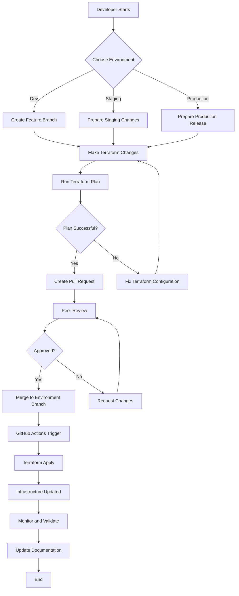
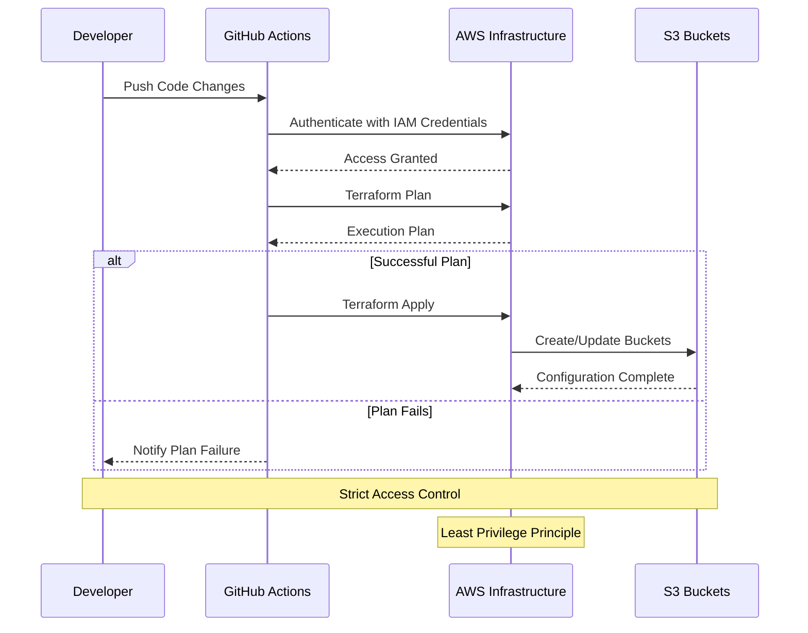

# AWS + Terraform + GitHub Actions Project

## Table of Contents
1. [Overview](#overview)
2. [Prerequisites for Beginners](#prerequisites-for-beginners)
3. [Project Architecture](#project-architecture)
4. [Project Structure](#project-structure)
5. [Required Tools](#required-tools)
6. [AWS IAM User Configuration](#aws-iam-user-configuration)
7. [Initial Setup](#initial-setup)
8. [Development Workflow](#development-workflow)
9. [Security and Access Flow](#security-and-access-flow)
10. [Best Practices](#best-practices)
11. [Advanced Configuration](#advanced-configuration)
12. [References](#references)
13. [Support](#support)

## Overview

This project provides a comprehensive infrastructure-as-code (IaC) solution using Terraform 1.11, AWS, and GitHub Actions. It's designed to help teams efficiently manage and deploy cloud infrastructure with best practices for multi-environment setups.

## Prerequisites for Beginners

### What You'll Need to Know

- **Cloud Computing Basics**: Understanding of cloud concepts like regions, services, and infrastructure
- **Version Control**: Basic familiarity with Git and GitHub
- **Command Line**: Comfort with using terminal/command prompt

### Learning Resources

If you're new to these technologies, consider reviewing:
- [AWS Cloud Practitioner Essentials](https://aws.amazon.com/training/course-descriptions/cloud-practitioner-essentials/)
- [Git & GitHub Crash Course](https://www.youtube.com/watch?v=SWYqp7iY_Tc)
- [Terraform Fundamentals](https://developer.hashicorp.com/terraform/tutorials/aws-get-started)

## Development Workflow

### Deployment Process Flowchart



## Project Architecture

The project creates a robust, scalable infrastructure for each environment (dev, stg, pro):

- **4 S3 Buckets** with specific purposes:
  - `[environment]-rublaman-landing_s3`: Initial data landing zone
  - `[environment]-rublaman-raw_s3`: Raw, unprocessed data storage
  - `[environment]-rublaman-curated_s3`: Cleaned and transformed data
  - `[environment]-rublaman-ready_s3`: Processed data ready for consumption

### Key Features
- Private bucket configurations
- Versioning enabled for data tracking
- Modular infrastructure design
- Consistent naming conventions
- Environment-specific deployments

## Project Structure

```
aws-terraform-project/
├── .github/
│   └── workflows/
│       └── terraform-deploy.yml     # CI/CD Workflow Configuration
├── terraform/
│   ├── modules/
│   │   └── s3-buckets/              # Reusable S3 Bucket Module
│   │       ├── main.tf              # S3 Resource Definitions
│   │       ├── variables.tf         # Configurable Module Parameters
│   │       └── outputs.tf           # Module Output Definitions
│   ├── main.tf                      # Primary Infrastructure Configuration
│   ├── variables.tf                 # Project-Wide Variables
│   ├── outputs.tf                   # Project Output Definitions
│   └── providers.tf                 # Cloud Provider Configuration
├── scripts/
│   └── bootstrap.sh                 # Infrastructure Initialization Script
└── README.md                        # Project Documentation
```

## Required Tools

1. **Terraform 1.11**
   - [Download from HashiCorp](https://www.terraform.io/downloads)
   - Verify installation: `terraform version`

2. **AWS CLI**
   - [Installation Guide](https://aws.amazon.com/cli/)
   - Verify installation: `aws --version`

3. **Git**
   - [Download Git](https://git-scm.com/downloads)
   - Verify installation: `git --version`

## AWS IAM User Configuration

### Creating an IAM User with Sufficient Permissions

1. **Access AWS IAM Console**
   - Log in to the AWS Management Console
   - Navigate to IAM (Identity and Access Management)

2. **Create New IAM User**
   - Go to "Users" > "Add users"
   - Choose a descriptive username (e.g., `terraform-deployment-user`)
   - Select "Provide user access to the AWS Management Console" (optional)

3. **Set Permissions**
   - Create a custom policy with the following JSON:
     ```json
     {
         "Version": "2012-10-17",
         "Statement": [
             {
                 "Sid": "FullS3Access",
                 "Effect": "Allow",
                 "Action": "s3:*",
                 "Resource": "*"
             }
         ]
     }
     ```
   - Note: This policy provides full S3 access. In a production environment, consider using more restrictive, least-privilege permissions.

4. **Generate Access Credentials**
   - After user creation, go to the user's security credentials
   - Create an access key
   - IMPORTANT: Save the Access Key ID and Secret Access Key immediately
   - These will be used only once, so store them securely

### Configuring GitHub Secrets

1. **Access GitHub Repository Settings**
   - Navigate to your repository
   - Click "Settings"
   - Select "Secrets and variables" > "Actions"

2. **Add AWS Credentials as Secrets**
   - Click "New repository secret"
   - Create two secrets:
     - Name: `AWS_ACCESS_KEY_ID`
       - Value: The access key ID from AWS IAM
     - Name: `AWS_SECRET_ACCESS_KEY`
       - Value: The secret access key from AWS IAM

3. **Security Considerations**
   - Never share these credentials
   - Rotate credentials periodically
   - Use the principle of least privilege
   - Consider using temporary credentials or AWS IAM roles for enhanced security

## Troubleshooting Common Issues

### Authentication Problems
- Ensure AWS credentials are correctly configured
- Check IAM user permissions
- Verify access key and secret are current

### Terraform State Management
- Never manually modify Terraform state files
- Use `terraform refresh` if state becomes out of sync
- Consider using remote state storage (as implemented in this project)

## Initial Setup

### 1. Prepare Your Environment

```bash
# Verify installed tools
terraform version
aws --version
git --version

# Configure AWS CLI
aws configure
```

### 2. Clone the Repository

```bash
git clone <repository-url>
cd aws-terraform-project
```

### 3. Create Environment Branches

```bash
# Create and publish environment-specific branches
git checkout -b dev
git add .
git commit -m "Initial project configuration"
git push -u origin dev

git checkout -b stg
git push -u origin stg

git checkout -b pro
git push -u origin pro
```

### 4. GitHub Environment Configuration

1. Repository Settings > Environments
2. Create three environments: `dev`, `stg`, `pro`
3. Configure environment-specific variables

### 5. Initialize Infrastructure

```bash
cd scripts
chmod +x bootstrap.sh

# Initialize each environment
./bootstrap.sh dev eu-south-2
./bootstrap.sh stg eu-south-2
./bootstrap.sh pro eu-south-2
```

## Development Workflow

1. **Branch Strategy**
   ```bash
   git checkout dev
   git pull
   git checkout -b feature/new-functionality
   ```

2. **Make Changes**
   - Modify Terraform configurations
   - Test locally with `terraform plan`

3. **Pull Request Process**
   - Create PR to environment branch
   - Automated `terraform plan` runs
   - Peer review required

4. **Merge and Deploy**
   - Approved PRs trigger `terraform apply`
   - Automatic infrastructure updates

## Security and Access Flow

### Infrastructure Access Mechanism

The project implements a robust security model that ensures controlled and traceable infrastructure deployments. The following diagram illustrates the access and deployment workflow:



### Key Security Principles

1. **Principle of Least Privilege**
   - IAM users are granted only the minimum permissions necessary
   - Custom IAM policies restrict access to specific resources
   - Separate credentials for each environment

2. **Controlled Deployment Process**
   - All infrastructure changes go through GitHub Actions
   - Mandatory code review and approval process
   - Automated planning and validation before deployment

3. **Secure Credential Management**
   - AWS credentials stored as encrypted GitHub secrets
   - No hard-coded credentials in the repository
   - Regular credential rotation recommended

## Best Practices

- Always use descriptive commit messages
- Keep modules small and reusable
- Use consistent naming conventions
- Implement proper access controls
- Regularly update provider versions

## Advanced Configuration

### Extending the Project
- Create new modules in `terraform/modules/`
- Define resources, variables, outputs
- Reference from `terraform/main.tf`

## References

- [Terraform Documentation](https://www.terraform.io/docs/)
- [AWS S3 Documentation](https://docs.aws.amazon.com/s3/)
- [GitHub Actions Guide](https://docs.github.com/en/actions)

## Support

Encounter issues? Check our troubleshooting section or open a GitHub issue in the repository.