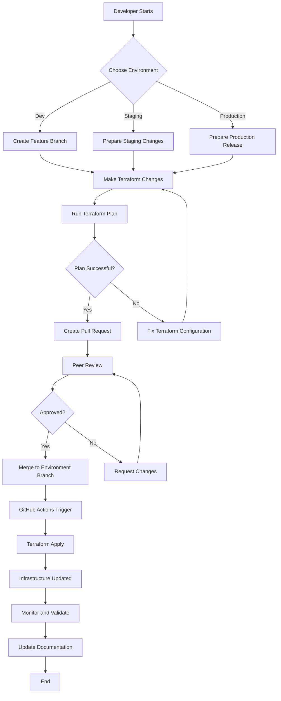
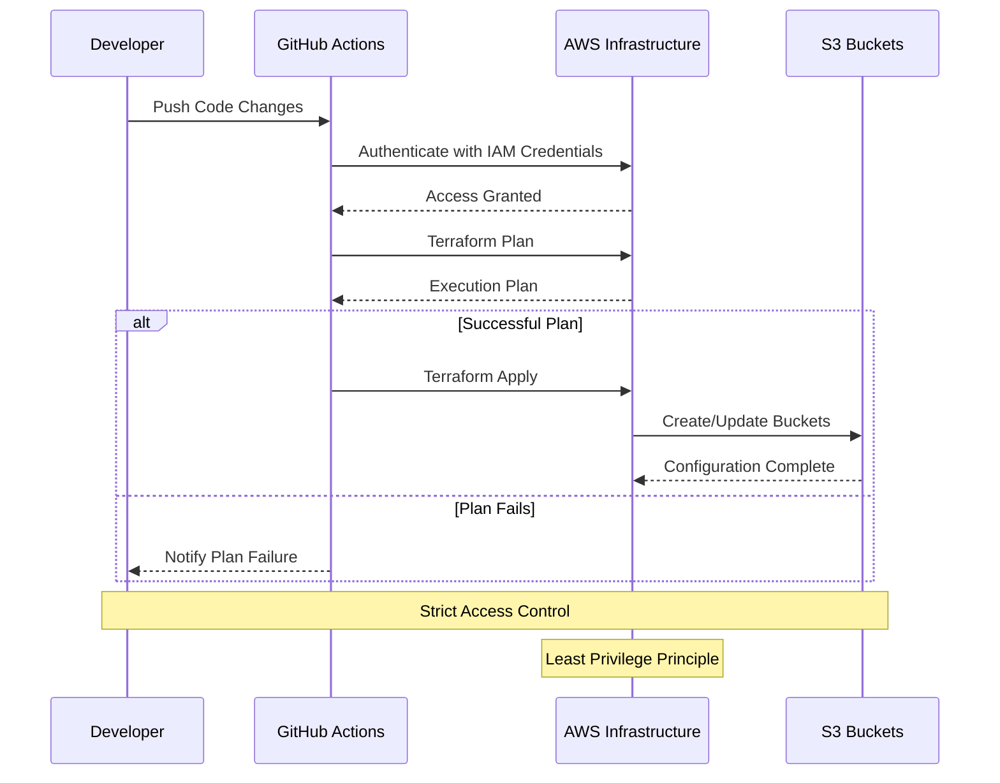

# AWS + Terraform + GitHub Actions Project

## Table of Contents
1. [Overview](#overview)
2. [Prerequisites for Beginners](#prerequisites-for-beginners)
3. [Project Architecture](#project-architecture)
4. [Project Structure](#project-structure)
5. [Required Tools](#required-tools)
6. [AWS IAM User Configuration](#aws-iam-user-configuration)
7. [GitHub Configuration](#github-configuration)
8. [Initial Setup](#initial-setup)
9. [Development Workflow](#development-workflow)
10. [Security and Access Flow](#security-and-access-flow)
11. [Best Practices](#best-practices)
12. [Troubleshooting Common Issues](#troubleshooting-common-issues)
13. [Advanced Configuration](#advanced-configuration)
14. [References](#references)
15. [Support](#support)

## Overview

This project provides a comprehensive infrastructure-as-code (IaC) solution using Terraform 1.11, AWS, and GitHub Actions. It's designed to help teams efficiently manage and deploy cloud infrastructure with best practices for multi-environment setups.

## Prerequisites for Beginners

### What You'll Need to Know

- **Cloud Computing Basics**: Understanding of cloud concepts like regions, services, and infrastructure
- **Version Control**: Basic familiarity with Git and GitHub
- **Command Line**: Comfort with using terminal/command prompt

### Learning Resources

If you're new to these technologies, consider reviewing:
- [AWS Cloud Practitioner Essentials](https://aws.amazon.com/training/course-descriptions/cloud-practitioner-essentials/)
- [Git & GitHub Crash Course](https://www.youtube.com/watch?v=SWYqp7iY_Tc)
- [Terraform Fundamentals](https://developer.hashicorp.com/terraform/tutorials/aws-get-started)

## Project Architecture

The project creates a robust, scalable infrastructure for each environment (dev, stg, pro):

- **4 S3 Buckets** with specific purposes:
  - `[environment]-project-name-landing_s3`: Initial data landing zone
  - `[environment]-project-name-raw_s3`: Raw, unprocessed data storage
  - `[environment]-project-name-curated_s3`: Cleaned and transformed data
  - `[environment]-project-name-ready_s3`: Processed data ready for consumption

### Key Features
- Private bucket configurations
- Versioning enabled for data tracking
- Modular infrastructure design
- Consistent naming conventions
- Environment-specific deployments

## Project Structure

```
aws-terraform-project/
├── .github/
│   └── workflows/
│       └── terraform-deploy.yml     # CI/CD Workflow Configuration
├── terraform/
│   ├── modules/
│   │   └── s3-buckets/              # Reusable S3 Bucket Module
│   │       ├── main.tf              # S3 Resource Definitions
│   │       ├── variables.tf         # Configurable Module Parameters
│   │       └── outputs.tf           # Module Output Definitions
│   ├── main.tf                      # Primary Infrastructure Configuration
│   ├── variables.tf                 # Project-Wide Variables
│   ├── outputs.tf                   # Project Output Definitions
│   └── providers.tf                 # Cloud Provider Configuration
├── scripts/
│   └── bootstrap.sh                 # Infrastructure Initialization Script
└── README.md                        # Project Documentation
```

## Required Tools

1. **Terraform 1.11**
   - [Download from HashiCorp](https://www.terraform.io/downloads)
   - Verify installation: `terraform version`

2. **AWS CLI**
   - [Installation Guide](https://aws.amazon.com/cli/)
   - Verify installation: `aws --version`

3. **Git**
   - [Download Git](https://git-scm.com/downloads)
   - Verify installation: `git --version`

## AWS IAM User Configuration

### Creating an IAM User with Sufficient Permissions

1. **Access AWS IAM Console**
   - Log in to the AWS Management Console
   - Navigate to IAM (Identity and Access Management)

2. **Create New IAM User**
   - Go to "Users" > "Add users"
   - Choose a descriptive username (e.g., `terraform-deployment-user`)
   - Select "Provide user access to the AWS Management Console" (optional)

3. **Set Permissions**
   - Create a custom policy with the following JSON:
     ```json
     {
         "Version": "2012-10-17",
         "Statement": [
             {
                 "Sid": "FullS3Access",
                 "Effect": "Allow",
                 "Action": "s3:*",
                 "Resource": "*"
             }
         ]
     }
     ```
   - Note: This policy provides full S3 access. In a production environment, consider using more restrictive, least-privilege permissions.

4. **Generate Access Credentials**
   - After user creation, go to the user's security credentials
   - Create an access key
   - IMPORTANT: Save the Access Key ID and Secret Access Key immediately
   - These will be used only once, so store them securely

## GitHub Configuration

### Creating and Configuring Environments

Before adding variables or secrets, you must first create each environment in GitHub:

1. **Create the Environments**
   - Navigate to your repository's **Settings**
   - In the sidebar, select **Environments**
   - Create three environments: `dev`, `stg`, and `pro`

2. **Configure Environment Variables for Each Environment**

   **For dev Environment:**
   
   | Variable               | Value                              |
   |------------------------|------------------------------------|
   | AWS_REGION             | eu-region-xx                       |
   | ENVIRONMENT            | dev                                |
   | S3_BUCKET_CURATED      | dev-project-name-curated_s3        |
   | S3_BUCKET_LANDING      | dev-project-name-landing_s3        |
   | S3_BUCKET_RAW          | dev-project-name-raw_s3            |
   | S3_BUCKET_READY        | dev-project-name-ready_s3          |
   | TERRAFORM_STATE_BUCKET | dev-project-name-terraform-state   |

   **For stg Environment:**
   
   | Variable               | Value                              |
   |------------------------|------------------------------------|
   | AWS_REGION             | eu-region-xx                       |
   | ENVIRONMENT            | stg                                |
   | S3_BUCKET_CURATED      | stg-project-name-curated_s3        |
   | S3_BUCKET_LANDING      | stg-project-name-landing_s3        |
   | S3_BUCKET_RAW          | stg-project-name-raw_s3            |
   | S3_BUCKET_READY        | stg-project-name-ready_s3          |
   | TERRAFORM_STATE_BUCKET | stg-project-name-terraform-state   |

   **For pro Environment:**
   
   | Variable               | Value                              |
   |------------------------|------------------------------------|
   | AWS_REGION             | eu-region-xx                       |
   | ENVIRONMENT            | pro                                |
   | S3_BUCKET_CURATED      | pro-project-name-curated_s3        |
   | S3_BUCKET_LANDING      | pro-project-name-landing_s3        |
   | S3_BUCKET_RAW          | pro-project-name-raw_s3            |
   | S3_BUCKET_READY        | pro-project-name-ready_s3          |
   | TERRAFORM_STATE_BUCKET | pro-project-name-terraform-state   |

3. **Configure Secrets for Each Environment**
   - Within each environment, add these secrets:
     - **AWS_ACCESS_KEY_ID**: Your AWS access key ID
     - **AWS_SECRET_ACCESS_KEY**: Your AWS secret access key

4. **Branch Protection Rules**
   - Navigate to **Settings** > **Branches**
   - Add rules for `develop`, `staging`, and `main` branches
   - Require pull request reviews before merging
   - Require status checks to pass before merging

## Initial Setup

### 1. Prepare Your Environment

```bash
# Verify installed tools
terraform version
aws --version
git --version

# Configure AWS CLI
aws configure
```

### 2. Clone the Repository

```bash
git clone <repository-url>
cd aws-terraform-project
```

### 3. Create Environment Branches

```bash
# Create and publish environment-specific branches
git checkout -b develop
git add .
git commit -m "Initial project configuration"
git push -u origin develop

git checkout -b staging
git push -u origin staging

git checkout -b main
git push -u origin main
```

### 4. Bootstrap Script Overview

The `bootstrap.sh` script performs initial setup for each environment:

```bash
#!/bin/bash
# bootstrap.sh
# Usage: ./bootstrap.sh <environment> <region>
# Example: ./bootstrap.sh dev eu-region-xx

ENVIRONMENT=$1
REGION=$2

if [ -z "$ENVIRONMENT" ] || [ -z "$REGION" ]; then
  echo "Error: Missing parameters"
  echo "Usage: ./bootstrap.sh <environment> <region>"
  exit 1
fi

# Create S3 bucket for Terraform state
BUCKET_NAME="${ENVIRONMENT}-project-name-terraform-state"
echo "Creating Terraform state bucket: $BUCKET_NAME"
aws s3api create-bucket \
  --bucket $BUCKET_NAME \
  --region $REGION \
  --create-bucket-configuration LocationConstraint=$REGION

# Enable versioning on the state bucket
aws s3api put-bucket-versioning \
  --bucket $BUCKET_NAME \
  --versioning-configuration Status=Enabled

echo "Terraform state bucket created and configured successfully."
```

### 5. Initialize Infrastructure

```bash
cd scripts
chmod +x bootstrap.sh

# Initialize each environment
./bootstrap.sh dev eu-region-xx
./bootstrap.sh stg eu-region-xx
./bootstrap.sh pro eu-region-xx
```

## Development Workflow

### Deployment Process Flowchart



### Step-by-Step Process

1. **Branch Strategy**
   ```bash
   git checkout develop
   git pull
   git checkout -b feature/new-functionality
   ```

2. **Make Changes**
   - Modify Terraform configurations
   - Test locally with `terraform plan`

3. **Pull Request Process**
   - Create PR to environment branch
   - Automated `terraform plan` runs
   - Peer review required

4. **Merge and Deploy**
   - Approved PRs trigger `terraform apply`
   - Automatic infrastructure updates

## Security and Access Flow

### Infrastructure Access Mechanism

The project implements a robust security model that ensures controlled and traceable infrastructure deployments. The following diagram illustrates the access and deployment workflow:



### Key Security Principles

1. **Principle of Least Privilege**
   - IAM users are granted only the minimum permissions necessary
   - Custom IAM policies restrict access to specific resources
   - Separate credentials for each environment

2. **Controlled Deployment Process**
   - All infrastructure changes go through GitHub Actions
   - Mandatory code review and approval process
   - Automated planning and validation before deployment

3. **Secure Credential Management**
   - AWS credentials stored as encrypted GitHub secrets
   - No hard-coded credentials in the repository
   - Regular credential rotation recommended

## Best Practices

- Always use descriptive commit messages
- Keep modules small and reusable
- Use consistent naming conventions
- Implement proper access controls
- Regularly update provider versions

## Troubleshooting Common Issues

### Authentication Problems
- Ensure AWS credentials are correctly configured in GitHub secrets
- Check IAM user permissions to verify they have the necessary access
- Verify that access keys are current and not expired

### Terraform State Issues
- If state becomes out of sync, use `terraform refresh` to update it
- Never manually modify Terraform state files
- Check S3 bucket permissions if you encounter access denied errors

### GitHub Actions Workflow Failures
- Verify that environment variables are correctly configured
- Check that branch names match the expected patterns (develop, staging, main)
- Review workflow logs to identify specific error messages

### S3 Bucket Creation Failures
- Check for naming conflicts (bucket names must be globally unique)
- Verify that you have permission to create S3 buckets
- Ensure region constraints are properly configured

## Advanced Configuration

### Extending the Project
- Create new modules in `terraform/modules/`
- Define resources, variables, outputs
- Reference from `terraform/main.tf`

### Adding Additional AWS Resources
To incorporate more AWS services beyond S3 buckets:

1. Create appropriate modules for each resource type
2. Define variables for environment-specific configurations
3. Update GitHub Actions workflow as needed for additional permissions

## References

- [Terraform Documentation](https://www.terraform.io/docs/)
- [AWS S3 Documentation](https://docs.aws.amazon.com/s3/)
- [GitHub Actions Guide](https://docs.github.com/en/actions)

## Support

Encounter issues? Check our troubleshooting section or open a GitHub issue in the repository for assistance.
